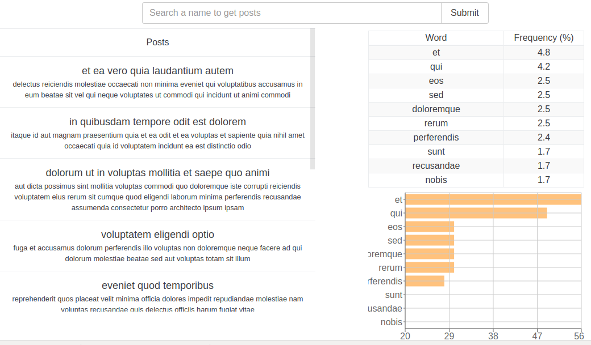

# ReduxSimpleStarter

Evolving our weather app for post showing and word analysis. The app can narrow down the posts 
by name of author and count the total number of words in comments made about all posts. 
Selecting a post also narrows the search down to the individual post.

[Demo website](https://serene-hollows-21887.herokuapp.com/)



### Getting Started

Checkout this repo, install dependencies, then start the gulp process with the following:

```
> git clone https://github.com/bmbigbang/ReduxSimpleStarter.git
> cd ReduxSimpleStarter
> npm install
> npm start
```


